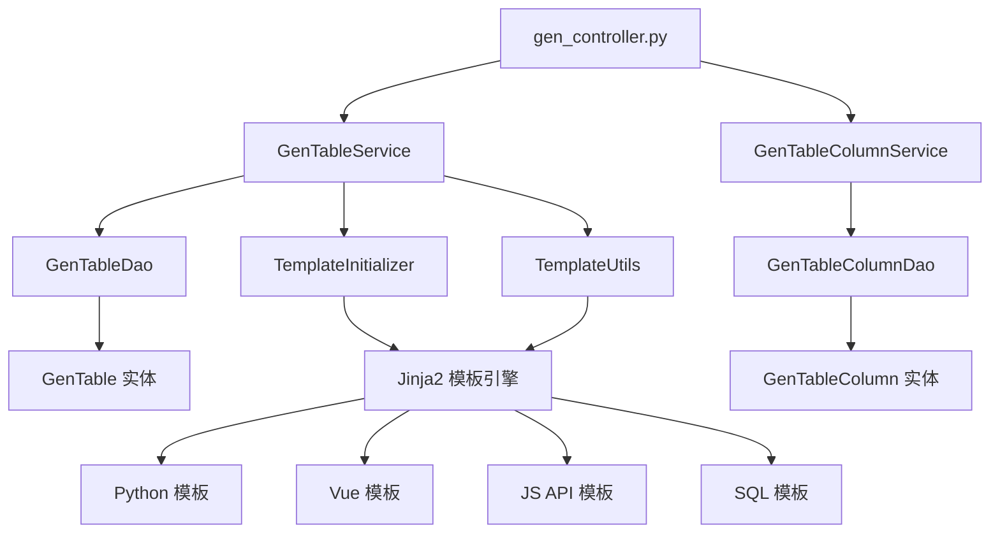

# RuoYi-Vue3-FastAPI 代码生成器功能 - 深度分析报告

## 概要总结

代码生成器是 RuoYi-Vue3-FastAPI 项目的核心工具模块，实现了基于数据库表结构的全栈代码自动化生成。该模块通过数据库反向工程技术，结合 Jinja2 模板引擎，能够自动生成包括后端 FastAPI 接口、前端 Vue3 页面、数据库操作层等完整的 CRUD 业务代码，极大地提高了开发效率和代码标准化程度。

## 模块架构

### 目录结构
```
ruoyi-fastapi-backend/module_generator/
├── controller/
│   └── gen_controller.py           # 代码生成控制器，提供生成相关 API
├── dao/
│   └── gen_dao.py                  # 数据访问层，操作生成表和字段信息
├── service/
│   └── gen_service.py              # 业务逻辑层，核心生成逻辑
├── entity/
│   ├── do/
│   │   └── gen_do.py              # 数据库实体类，GenTable 和 GenTableColumn
│   └── vo/
│       └── gen_vo.py              # 视图对象类，各种请求响应模型
└── templates/                     # Jinja2 模板目录
    ├── python/                    # Python 后端代码模板
    │   ├── controller.py.jinja2   # 控制器模板
    │   ├── service.py.jinja2      # 服务层模板
    │   ├── dao.py.jinja2          # 数据访问层模板
    │   ├── do.py.jinja2           # 实体类模板
    │   └── vo.py.jinja2           # 视图对象模板
    ├── vue/                       # Vue 前端页面模板
    │   ├── index.vue.jinja2       # CRUD 页面模板
    │   ├── index-tree.vue.jinja2  # 树表页面模板
    │   └── v3/                    # Vue3 Element Plus 模板
    ├── js/
    │   └── api.js.jinja2          # API 接口模板
    └── sql/
        └── sql.jinja2             # SQL 脚本模板

ruoyi-fastapi-frontend/src/views/tool/
├── gen/                          # 代码生成前端页面
│   ├── index.vue                 # 生成管理主页面
│   ├── editTable.vue            # 表配置编辑页面
│   ├── genInfoForm.vue          # 生成信息配置表单
│   ├── basicInfoForm.vue        # 基础信息配置表单
│   ├── importTable.vue          # 导入表弹窗
│   └── createTable.vue          # 创建表弹窗
└── build/                       # 表单构建器
    └── index.vue                 # 可视化表单设计器
```

### 组件层次结构


### 依赖关系和导入
- **模板引擎**: Jinja2 + FileSystemLoader
- **数据库操作**: SQLAlchemy ORM, AsyncSession
- **SQL解析**: sqlglot (支持多种数据库方言)
- **工具依赖**: GenUtils, TemplateUtils, CamelCaseUtil, SnakeCaseUtil
- **配置依赖**: GenConfig, DataBaseConfig
- **权限控制**: CheckUserInterfaceAuth, CheckRoleInterfaceAuth

## 核心功能分析

### 主要功能

#### 1. 数据库表导入与管理
- **文件位置**: `gen_controller.py:L49-L61`, `gen_service.py:L45-L112`
- **实现方式**:
  ```python
  # 获取数据库表列表
  async def get_gen_db_table_list_services(cls, query_db, query_object, is_page=False)
  
  # 导入选中的数据库表
  async def import_gen_table_services(cls, query_db, gen_table_list, current_user)
  
  # 数据库表结构同步
  async def sync_db_services(cls, query_db, table_name)
  ```
- **功能目的**: 从现有数据库表结构导入生成配置，支持表结构变更同步
- **关键依赖**: GenTableDao, GenTableColumnDao, GenUtils.init_table()

#### 2. 生成配置管理
- **文件位置**: `gen_service.py:L113-L182`, `editTable.vue:L151-L192`
- **实现方式**:
  ```python
  # 编辑生成表配置
  async def edit_gen_table_services(cls, query_db, page_object)
  
  # 配置参数校验
  async def validate_edit(cls, edit_gen_table)
  
  # 设置生成选项
  async def set_table_from_options(cls, gen_table)
  ```
- **功能目的**: 管理表的生成配置，包括模板类型、生成路径、业务信息等
- **关键依赖**: EditGenTableModel, 参数验证机制

#### 3. 代码生成引擎
- **文件位置**: `gen_service.py:L272-L321`, `template_util.py:L40-L150`
- **实现方式**:
  ```python
  # 核心生成方法
  async def generate_code_services(cls, query_db, table_name):
      env = TemplateInitializer.init_jinja2()
      render_info = await cls.__get_gen_render_info(query_db, table_name)
      for template in render_info[0]:
          render_content = env.get_template(template).render(**render_info[2])
          gen_path = cls.__get_gen_path(render_info[3], template)
          # 写入文件
          with open(gen_path, 'w', encoding='utf-8') as f:
              f.write(render_content)
  
  # 批量生成
  async def batch_gen_code_services(cls, query_db, table_names)
  ```
- **功能目的**: 基于配置和模板生成完整的业务代码
- **关键依赖**: Jinja2, TemplateUtils, 文件系统操作

#### 4. 代码预览功能
- **文件位置**: `gen_service.py:L200-L240`
- **实现方式**:
  ```python
  async def preview_code_services(cls, query_db, table_id):
      # 获取渲染信息
      render_info = await cls.__get_gen_render_info_by_table_id(query_db, table_id)
      preview_data = {}
      # 渲染所有模板
      for template in render_info[0]:
          render_content = env.get_template(template).render(**render_info[2])
          preview_data[template] = render_content
      return preview_data
  ```
- **功能目的**: 在生成前预览代码，支持在线查看和复制
- **关键依赖**: 模板渲染引擎，前端代码展示组件

### 次要功能

#### 1. 创建表功能
- **文件位置**: `gen_controller.py:L84-L96`, `createTable.vue`
- **实现方式**: 使用 sqlglot 解析 SQL DDL 语句并执行
- **功能目的**: 支持通过 SQL 语句直接创建数据库表

#### 2. 表字段配置
- **文件位置**: `gen_vo.py:L150-L263`, `editTable.vue:L60-L149`
- **实现方式**: 提供字段级别的生成配置，包括显示控制、查询条件、HTML 控件类型等
- **功能目的**: 精细化控制每个字段在生成代码中的行为

#### 3. 数据导出功能
- **文件位置**: Excel 导出支持，与字典模块类似的导出机制
- **实现方式**: 将生成配置导出为 Excel 格式
- **功能目的**: 支持生成配置的备份和批量管理

## 关键实现细节

### 模板引擎架构

#### Jinja2 初始化
```python
class TemplateInitializer:
    @classmethod
    def init_jinja2(cls):
        template_dir = os.path.join(os.getcwd(), 'module_generator', 'templates')
        env = Environment(
            loader=FileSystemLoader(template_dir),
            keep_trailing_newline=True,
            trim_blocks=True,
            lstrip_blocks=True,
        )
        # 注册自定义过滤器
        env.filters.update({
            'camel_to_snake': SnakeCaseUtil.camel_to_snake,
            'snake_to_camel': CamelCaseUtil.snake_to_camel,
            'get_sqlalchemy_type': TemplateUtils.get_sqlalchemy_type,
        })
        return env
```

#### 模板上下文准备
```python
def prepare_context(cls, gen_table: GenTableModel):
    context = {
        'tplCategory': tpl_category,
        'tableName': gen_table.table_name,
        'functionName': function_name,
        'ClassName': class_name,
        'className': class_name.lower(),
        'moduleName': module_name,
        'BusinessName': business_name.capitalize(),
        'businessName': business_name,
        'packageName': package_name,
        'author': gen_table.function_author,
        'datetime': datetime.now().strftime('%Y-%m-%d %H:%M:%S'),
        'pkColumn': gen_table.pk_column,
        'columns': gen_table.columns,
        'table': gen_table,
        'permissionPrefix': cls.get_permission_prefix(module_name, business_name)
    }
    return context
```

### 生成模式配置

#### 支持的模板类型
- **TPL_CRUD**: 单表 CRUD 操作（默认）
- **TPL_TREE**: 树形结构表操作
- **TPL_SUB**: 主子表关联操作

#### 前端框架支持
- **element-ui**: Vue2 + Element UI 模板
- **element-plus**: Vue3 + Element Plus 模板（推荐）

#### 生成方式选择
- **ZIP 压缩包**: 打包下载所有生成文件
- **自定义路径**: 直接生成到指定目录

### 字段映射机制

#### 数据库类型映射
```python
DB_TO_SQLALCHEMY_TYPE_MAPPING = {
    'tinyint': 'Integer',
    'smallint': 'Integer', 
    'mediumint': 'Integer',
    'int': 'Integer',
    'bigint': 'BigInteger',
    'float': 'Float',
    'double': 'Float',
    'decimal': 'Numeric',
    'varchar': 'String',
    'text': 'Text',
    'datetime': 'DateTime',
    'timestamp': 'DateTime'
}

DB_TO_PYTHON_TYPE_MAPPING = {
    'tinyint': 'int',
    'smallint': 'int',
    'int': 'int', 
    'bigint': 'int',
    'float': 'float',
    'double': 'float',
    'decimal': 'Decimal',
    'varchar': 'str',
    'text': 'str',
    'datetime': 'datetime',
    'date': 'date'
}
```

#### HTML 控件类型
```python
HTML_INPUT = 'input'           # 文本框
HTML_TEXTAREA = 'textarea'     # 文本域
HTML_SELECT = 'select'         # 下拉框
HTML_RADIO = 'radio'          # 单选框
HTML_CHECKBOX = 'checkbox'     # 复选框
HTML_DATETIME = 'datetime'     # 日期控件
HTML_IMAGE_UPLOAD = 'imageUpload'  # 图片上传
HTML_FILE_UPLOAD = 'fileUpload'    # 文件上传
HTML_EDITOR = 'editor'         # 富文本编辑器
```

### 权限控制集成

#### 权限字符生成
```python
def get_permission_prefix(module_name: str, business_name: str):
    return f"{module_name}:{business_name}"

# 生成的权限字符示例:
# system:user:list    # 列表查看
# system:user:add     # 新增
# system:user:edit    # 编辑  
# system:user:remove  # 删除
# system:user:query   # 详情查看
# system:user:export  # 导出
```

## 集成点

### 数据库集成
- **表结构**: `gen_table` 存储生成表配置，`gen_table_column` 存储字段配置
- **多数据库支持**: 通过 sqlglot 支持 MySQL、PostgreSQL 等多种数据库
- **动态查询**: 运行时查询数据库表结构和字段信息

### 前端集成
- **管理界面**: 完整的代码生成管理前端，支持表导入、配置编辑、代码预览等
- **表单构建器**: 独立的可视化表单设计器
- **API 集成**: 与后端生成接口完全对接

### 文件系统集成
- **生成路径**: 可配置的代码生成输出路径
- **ZIP 打包**: 支持将生成的代码打包为 ZIP 文件下载
- **模板管理**: 模块化的模板文件组织和管理

## 代码示例

### 生成配置示例
```python
# 导入数据库表
table_names = ['sys_user', 'sys_role', 'sys_menu']
gen_table_list = await GenTableService.get_gen_db_table_list_by_name_services(
    query_db, table_names
)
result = await GenTableService.import_gen_table_services(
    query_db, gen_table_list, current_user
)

# 配置生成信息
edit_gen_table = EditGenTableModel(
    tableId=1,
    tplCategory='crud',  # 单表模式
    tplWebType='element-plus',  # Vue3 模板
    packageName='module_admin.system',
    moduleName='system',
    businessName='user',
    functionName='用户管理',
    genType='0',  # ZIP下载
)

# 生成代码
result = await GenTableService.generate_code_services(query_db, 'sys_user')
```

### 前端使用示例
```vue
<template>
  <div>
    <!-- 导入表按钮 -->
    <el-button 
      type="info" 
      @click="openImportTable" 
      v-hasPermi="['tool:gen:import']"
    >
      导入表
    </el-button>
    
    <!-- 生成代码按钮 -->
    <el-button 
      type="primary" 
      @click="handleGenTable" 
      v-hasPermi="['tool:gen:code']"
    >
      生成代码
    </el-button>
    
    <!-- 预览代码按钮 -->
    <el-button 
      type="success" 
      @click="handlePreview" 
      v-hasPermi="['tool:gen:preview']"
    >
      预览代码
    </el-button>
  </div>
</template>

<script setup>
import { listTable, previewTable, genCode } from '@/api/tool/gen';

// 预览代码
async function handlePreview(row) {
  const response = await previewTable(row.tableId);
  // 显示预览弹窗
  preview.value.data = response.data;
  preview.value.open = true;
}

// 生成代码
function handleGenTable(row) {
  if (row.genType === '1') {
    // 生成到自定义路径
    genCode(row.tableName).then(response => {
      proxy.$modal.msgSuccess('成功生成到自定义路径：' + row.genPath);
    });
  } else {
    // ZIP下载
    proxy.$download.zip('/tool/gen/batchGenCode?tables=' + tbNames, 'generated.zip');
  }
}
</script>
```

### 模板示例
```jinja2
{# controller.py.jinja2 模板示例 #}
from fastapi import APIRouter, Depends
from {{ packageName }}.service.{{ businessName }}_service import {{ BusinessName }}Service

{{ businessName }}Controller = APIRouter(prefix='/{{ moduleName }}/{{ businessName }}')

@{{ businessName }}Controller.get('/list')
async def get_{{ businessName }}_list(
    {{ businessName }}_query: {{ BusinessName }}PageQueryModel = Depends({{ BusinessName }}PageQueryModel.as_query),
    query_db: AsyncSession = Depends(get_db),
):
    result = await {{ BusinessName }}Service.get_{{ businessName }}_list_services(
        query_db, {{ businessName }}_query, is_page=True
    )
    return ResponseUtil.success(model_content=result)
```

## 架构决策

### 1. 基于模板的代码生成
**决策**: 采用 Jinja2 模板引擎进行代码生成
**原因**:
- 模板与逻辑分离，便于维护和扩展
- 支持复杂的条件逻辑和循环结构
- 提供强大的过滤器和函数扩展能力
- 生成代码格式规范一致

### 2. 数据库反向工程
**决策**: 从数据库表结构反向生成代码配置
**原因**:
- 充分利用已有的数据库设计
- 减少重复的配置工作
- 保证代码与数据库结构的一致性
- 支持数据库变更的增量同步

### 3. 多模板类型支持
**决策**: 支持单表、树表、主子表等多种业务模式
**原因**:
- 覆盖常见的业务场景需求
- 提供针对性的代码生成策略
- 减少后期的代码修改工作
- 提高生成代码的可用性

### 4. 配置化的生成策略
**决策**: 提供丰富的配置选项控制生成行为
**原因**:
- 满足不同项目的个性化需求
- 支持字段级别的精细控制
- 便于生成代码的定制化
- 提高开发者的使用体验

## 扩展应用建议

### 1. 自定义模板支持
```python
# 扩展自定义模板目录
CUSTOM_TEMPLATE_PATH = 'custom_templates'

class CustomTemplateLoader:
    def load_custom_templates(self, template_type):
        # 加载用户自定义模板
        pass
```

### 2. 代码质量检查
```python
# 集成代码质量检查工具
class CodeQualityChecker:
    def check_generated_code(self, code_content):
        # 使用 flake8, black 等工具检查代码质量
        pass
```

### 3. 版本控制集成
```python
# 集成 Git 版本控制
class GitIntegration:
    def commit_generated_code(self, file_paths, commit_message):
        # 自动提交生成的代码到版本库
        pass
```

### 4. API 文档生成
```python
# 自动生成 OpenAPI 文档
class ApiDocGenerator:
    def generate_openapi_spec(self, gen_table):
        # 基于生成配置生成 API 文档
        pass
```

## 潜在改进点

### 1. 模板热更新
- **当前问题**: 模板修改需要重启应用
- **改进建议**: 实现模板文件监控和热更新机制

### 2. 增量生成支持
- **当前问题**: 只支持全量重新生成
- **改进建议**: 支持基于变更的增量代码生成

### 3. 多语言支持
- **当前问题**: 主要支持 Python + Vue3
- **改进建议**: 扩展支持 Java、Go、React 等技术栈

### 4. 可视化配置
- **当前问题**: 部分配置需要手工编辑
- **改进建议**: 提供更直观的可视化配置界面

### 5. 测试代码生成
- **当前问题**: 不生成单元测试代码
- **改进建议**: 自动生成对应的测试代码和测试数据

## 总结

RuoYi-Vue3-FastAPI 的代码生成器是一个功能完整、设计精良的开发工具，具备以下核心优势：

1. **全栈代码生成**: 支持从后端 API 到前端页面的完整代码生成
2. **模板化架构**: 基于 Jinja2 的灵活模板系统，易于扩展和定制
3. **多业务模式**: 支持单表、树表、主子表等多种业务场景
4. **配置化管理**: 提供丰富的配置选项和可视化管理界面
5. **标准化输出**: 生成的代码遵循项目规范，质量可控
6. **权限集成**: 自动集成权限控制和日志记录功能

该代码生成器显著提高了开发效率，降低了重复劳动，是快速开发企业级应用的重要工具。通过合理的配置和使用，开发团队可以将更多精力投入到业务逻辑的实现上，而不是基础代码的编写。随着模板的不断完善和功能的持续增强，该生成器将成为项目开发的核心生产力工具。